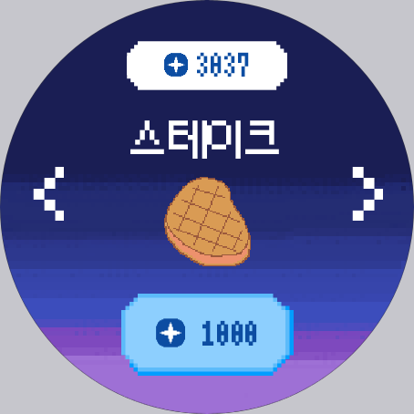

# 🌕 내 손 안의 작은 펫, PayMong 🌕

[PayMong - Google Play 앱](https://play.google.com/store/apps/details?id=com.paymong&hl=ko)

---

### 1️⃣ 프로젝트 개요

🌕 **개발 기간**

| 개발기간 | 2023.04.10 ~ 2023.05.19 (6주) |
| --- | --- |

🌕 **팀원 소개**

| 팀원 | 역할 |
| --- | --- |
| 황수빈 | 팀장, 안드로이드, 디자인, FE |
| 나유진 | BE, DB, TEST |
| 권혁근 | BE, Infra(CI/CD), DB |
| 박상민 | 안드로이드, FE, BE, 크롤링 |
| 김유민 | 안드로이드, 디자인, FE |
| 정경훈 | BE, 소켓, 로직, DB, 맛점좌 |

🌕 **기획 의도**

| 2022년 전세계 스마트 워치 유통량은 전년대비 12% 상승 |
| --- |
| 전국 1003명을 대상으로 스마트 워치 사용비율을 조사한 결과, 2021년 6월 19%, 전년대비 7% 가 증가 |
| 약 1200개의 워치 전용 앱을 확인한 결과, 시계페이스가 약 74%로 대부분을 차지 |

🌕 **목표**

|  나만의 페이몽 키우기 서비스를 통해 앱의 다양성을 높이고 워치의 활용도를 올리는 것 |
| --- |

---

### 2️⃣ 서비스 기능 소개

🌕 **워치**

- 배틀
- 음식먹이기
- 잠자기
- 똥 치우기
- 훈련 & 산책

🌕 **스마트폰**

- 삼성페이 연동

- 삼성 스마트싱스 연동

- 도움말

---

### 3️⃣ 기술 스택

- ***Jetpack Compose***
    - Kotlin으로 제작된 UI 도구
    - 선언형 프로그래밍
    - Compose를 통해 ***Single Activity*** ***Architecture (SAA)*** 의 애플리케이션 구현
    
- ***OKHttps3***
    - 기본적으로 효율적인 HTTP 클라이언트
    - HTTP 기반의 request/response를 할 수 있도록 도와주는 오픈 소스 라이브러리
    - 실시간 서버 연결
    - 모바일 ↔ 웨어러블 기기 간 소켓 통신을 통해 동기화 (몽 정보 동기화, 배틀 매칭 및 배틀 진행)
    
- ***retrofit2***
    - 안드로이드와 서버 간의 REST API 통신을 도와주는 라이브러리
    - 빠른 성능을 자랑하고 AsyncTask 보다 3 ~ 10배의 성능 차이가 남
    - 간단한 구현 / 가독성이 뛰어남
    
- ***MSA***
    - 여러 개의 작은 마이크로 서비스로 쪼개어 변경과 조합이 가능하도록 만든 구조
    - 많은 부하가 생기는 스케줄러와 소켓 기능을 가진 서버가 있기 때문에 다른 서비스로 분리하여 부하를 분산

- ***Spring Socket***
    - 실시간 배틀 매칭 서버 구현
    - 실시간 배틀 진행 서버 구현
    - 모바일 ↔ 웨어러블 기기 간 몽 정보 동기화를 위해 서버 구현
    
- ***Spring Scheduler***
    - 일정 주기마다 작업을 자동으로 실행하여 몽의 생애주기를 관리함

---

### 4️⃣ 아키텍처

---

### 5️⃣ 기대효과

---

### 6️⃣ 차별점

🌕 **삼성페이 연동**

삼성페이로 결제시 해당 금액의 10%를 포인트로 지급

***스타벅스, 버거킹 등 38가지의 다양한 브랜드 제품 결제시 해당 맵으로 1시간 동안 게임의 배경 변경***

🌕 **삼성 스마트싱스 연동**

스마트 싱스에 등록해 놓은 다양한 제품을 사용하면 그에 맞는 상호작용이 페이몽에 적용

예) 청소기 구동시 페이몽의 똥 치우기 + 포인트 보너스 + 실시간 이벤트

***청소기 / 문 열림 센서 / 충전기와 연동한 예시***

---

## 7️⃣ 기능 개요

### 🍎 식사

### 🧻 화장실

### 🏋️ 훈련

### 👣 산책

### 😴 수면

### 🥊 배틀

### 😍 쓰다듬기 (행복)

### ℹ️ 캐릭터 정보 확인

---

## 8️⃣ 게임 로직 🕹️

### 📊 지수

| 지수 | + | - | 상세 설명 | UI |
| --- | --- | --- | --- | --- |
| 포만감 | 밥,간식 | 시간,훈련,산책 |  | 진행상태 표시기(%) |
| 체력 | 수면,간식 | 훈련,산책,똥갯수 | 똥 갯수 * (1, 4, 9, 16칸 랜덤) | 진행상태 표시기(%) |
| 근력 | 훈련,산책 | 시간,간식 |  | 진행상태 표시기(%) |
| 수면 | 수면 | 시간,훈련,산책 |  | 진행상태 표시기(%) |

## 🥚 캐릭터 진화 단계

- **총 4단계**

***→ 페이몽 대표 캐릭터***

- **캐릭터 색깔 : 일반 5개**
    - 패널티(P) : 똥이 4개된 횟수
    - 트레이닝(T) : 트레이닝 횟수
    - 쓰다듬기(L) : 쓰다듬기 횟수
    
    
    

- ( 진화에 필요한 시간 / 피 통 갯수 )
1. 0단계 ( 10분 )
    - 알

1. 1단계 ( 12시간 / 20칸 )
    - 동그라미
    - 네모
    - 별
    
2. 2단계 ( 36시간 / 30칸 )
    - 동그라미, 네모, 별

1. 3단계 ( 24시간 / 40칸 )
    - 동그라미, 네모, 별

⛔ 시간 측정에서 캐릭터 잠자는 시간은 제외

⛔ 체력, 포만감, 근력, 단계별로 20, 30, 40 (수면은 제외)

## 📚 도감

- 단계 별로 유저가 획득한 것만 표시

## 💀 죽음

1. 포만감 0으로 3시간 유지 됐을 때 
2. 체력 0으로 3시간 유지 됐을 때

## 🍎먹이

| 도메인 | 지수 | 칸 | 설명 | 포인트 |
| --- | --- | --- | --- | --- |
| 밥 | 포만감 | +1 | 뼈생선 | 100 |
| 밥 | 포만감 | +6 | 사과 / 샌드위치 / 삼각김밥 | 500 |
| 밥 | 포만감 | +13 | 피자 / 닭다리 / 스테이크 | 1000 |
| 밥 | 모두 | FULL | 우주 음식 | 5000 |
| 간식 | 포만감 | +2 | 초콜릿 / 사탕 / 음료수 | 300 |
|  | 체력 | +1 |  |  |
|  | 근력 | -1 |  |  |
| 간식 | 포만감 | +5 | 쿠키 / 케잌 / 감튀 | 600 |
|  | 체력 | +3 |  |  |
|  | 근력 | -2 |  |  |

## 🏋️훈련

- 버튼 연속 클릭
- 훈련을 진행할 때 50포인트 소비

| 이름 | 지수 | 칸 |
| --- | --- | --- |
| 훈련 | 포만감 | -2 |
|  | 체력 | -2 |
|  | 수면 | -2 |
|  | 근력 | +3 |

## 👣산책

- 걸음수만큼 비례해서  상승
- 500걸음 이상 걸었을 때만 지수 감소시키기 ( 실수한 사용자를 위해 😋)

| 이름 | 지수 | 칸 |
| --- | --- | --- |
| 산책 | 포만감 | -5 |
|  | 체력 | -5 |
|  | 수면 | -5 |
|  | 근력 | + 500걸음에 1 |
|  | 포인트 | + 10걸음에 1 |

## 😴 수면

- 수면 시 똥 안쌈💩

| 이름 | 지수 | 칸 |
| --- | --- | --- |
| 수면 | 체력 | + 1시간 25%, 3시간 100% |
|  | 수면 | + 1시간 25%, 3시간 100% |

## 🕛시간

| 이름 | 지수 | 칸 |
| --- | --- | --- |
| 시간 | 포만감 | - 15분에 1칸 |
|  | 근력 | - 15분에 1칸 |
|  | 수면 | - 30분에 1칸 |

## 💩 똥

- 최소 30분 ~ 최대 1시간 랜덤

## 👤몸무게

- 0단계
    - 5g (고정)
- 1단계
    - 기존 몸무게에서 15g 증가
    - 최소 15g
- 2단계
    - 기존 몸무게에서 25g 증가
    - 최소 25g
- 3단계
    - 기존 몸무게에서 35g 증가
    - 최소 35g
    

| 도메인 | g | 설명 |
| --- | --- | --- |
| 밥 | +1 | 뼈생선 |
|  |  |  |
| 밥 | +2 | 사과, 샌드위치, 삼각김밥 |
| 밥 | +3 | 피자, 닭다리, 스테이크 |
| 간식 | +1 | 초콜릿, 사탕, 음료수 |
| 간식 | +2 | 쿠키, 케잌, 감튀 |
| 훈련 | -2 |  |
| 산책 | -3 |  |

## 💳 소비 라벨링

| MP000 | 메인 | MP019 | CU |
| --- | --- | --- | --- |
| MP001 | 스타벅스 | MP020 | 올리브영 |
| MP002 | 이디야 | MP021 | 나이키 |
| MP003 | 할리스 | MP022 | 아디다스 |
| MP004 | 투썸플레이스 | MP023 | 다이소 |
| MP005 | 메가커피 | MP024 | PC방 |
| MP006 | 파스쿠찌 | MP025 | 노래방 |
| MP007 | 블루보틀 | MP026 | 던킨도너츠 |
| MP008 | 하이오커피 | MP027 | 파리바게트 |
| MP009 | 블루샥 | MP028 | 뚜레쥬르 |
| MP010 | 컴포즈커피 | MP029 | 배스킨라빈스31 |
| MP011 | 맥도날드 | MP030 | 설빙 |
| MP012 | 버거킹 | MP031 | KFC |
| MP013 | 롯데리아 | MP032 | 롯데시네마 |
| MP014 | 맘스터치 | MP033 | 쿠팡 |
| MP015 | CGV | MP034 | 요기요 |
| MP016 | 메가박스 | MP035 | 배달의민족 |
| MP017 | 이마트24 | MP036 | 카페 |
| MP018 | GS25 | MP037 | 세븐일레븐 |
|  |  | MP038 | 싸피자판기 |

## ⌚워치 플로우

- 접속
    - 왼쪽 : 지수
    - 메인창 : 캐릭창
    - 오른쪽 1번 : 상호작용
    - 오른쪽 2번 : 정보

- 상호작용
    - 먹기
        - 밥
        - 간식
    - 트레이닝
        - 훈련
        - 산책
    - 잠 ( 깨우기 )
        - 최대 3시간
    - 배틀
        - 500 고정
        - 상대와 태그 하세요 로딩
    - 똥 치우기
- 메인창
    - 캐릭터 클릭 시 표정변화

## 🥊배틀

- 배틀을 켜고 있다가 GPS로 감지한 서로 상대방 정보를 서버로 올림
- 턴 제도 ( 첫번째 공격자 랜덤 )
- 참참참 같은 느낌
    - 매 턴 공격자, 수비자 정해짐
    - 각자 방향 선택
    - 공격자는 선택한 방향으로 공격
    - 수비자는 선택한 방향으로 회피
- 몸무게 = 방어력  ///  근력 = 공격
- 서로의 피를 알 수 있음
- 받는 데미지 : 상대 데미지 * 100/(100+나의 방어력)
- 주는 데미지 : 100 + 나의 공격력
- 최대 10번 턴 제
- 체력 500
